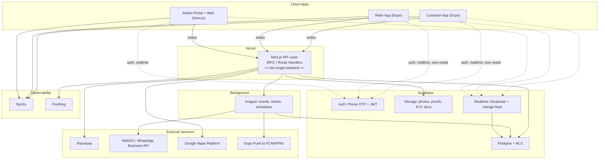
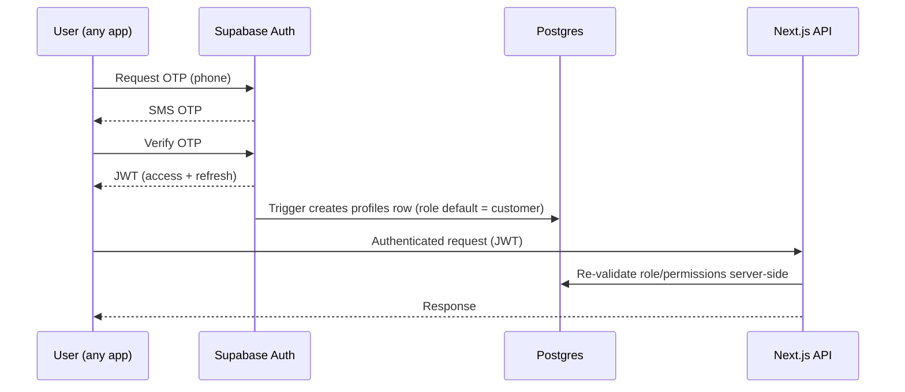
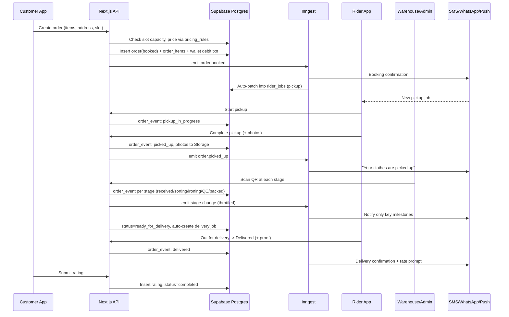
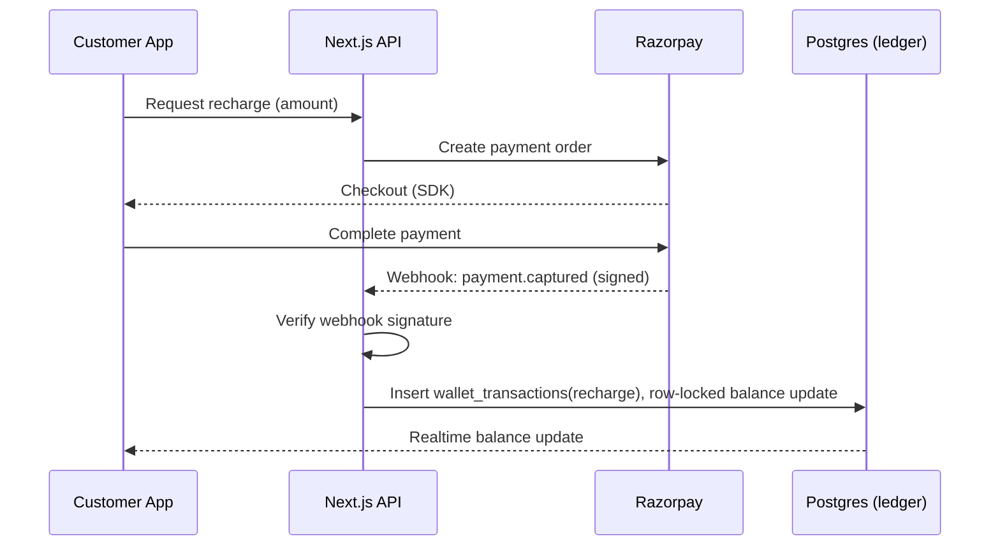
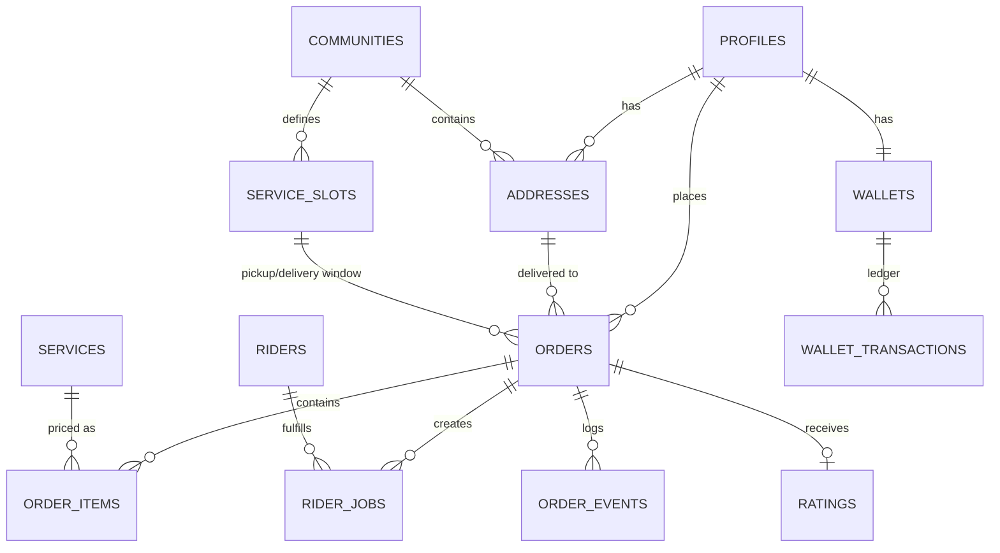

# Iron Cloud — Technical Architecture Document (TAD)

**Version:** 1.0
**Companion to:** Iron Cloud PRD v1.0
**Type:** Production architecture (not MVP)
**Stack:** Supabase · Vercel · Next.js · Expo (+ improvised additions, flagged below)

---

## 0. Key Assumptions

- India-only, single currency (INR), single primary warehouse at launch — schema supports multiple warehouses/communities without migration.
- "Single backend" = one API layer that both Expo apps and the Next.js web app call. Not three separate backends.
- Phase 1 = ironing only, but modeled so Phase 2–7 (laundry, dry cleaning, shoe cleaning, repairs, subscriptions, B2B — per your PRD §24) are catalog entries, not rewrites.

---

## 1. Architecture Principles

1. **One backend, many clients.** All business logic (pricing, wallet, assignment, state transitions) lives in a single Next.js API layer. Nothing is duplicated per client.
2. **Event-sourced orders.** Every status change is an immutable row in `order_events`, not just a column overwrite — this powers the audit trail, live tracking, and support investigations.
3. **Ledger-based money.** Wallet balance is never edited directly; it's derived from an append-only `wallet_transactions` ledger. This is the only safe pattern under concurrent requests.
4. **RLS-first, API-enforced.** Postgres Row-Level Security is the deny-by-default boundary for reads. Anything with a side effect (money, state, notifications) is written only through the API using the service role — RLS alone never guards a write that has business rules attached.
5. **Built for Phase 2+ without a rewrite.** Services are a catalog (`services` table), not a hardcoded "ironing" assumption.
6. **Background work never blocks a request.** Vercel functions are short-lived; anything that retries, waits, or runs on schedule goes through a durable job runner.

---

## 2. System Architecture



### What "single backend" means here

Order creation, pricing, wallet debits/refunds, rider assignment, admin actions — **every write with business logic goes through Next.js Route Handlers** (wrapped in tRPC for shared types across Expo + Next.js), deployed on Vercel. This is the only place holding the Supabase **service role key**; it never ships to a client.

Clients talk to Supabase **directly** only for three things, all governed by RLS: auth session, Realtime subscriptions, and simple own-data reads (my orders, my wallet, my profile). That keeps live tracking and reads fast without scattering business logic across three codebases.

### Stack table

| Layer | Technology | Source |
|---|---|---|
| Mobile (Customer + Rider) | Expo (React Native) + Expo Router | Your stack |
| Web (Admin + Customer web + Marketing) | Next.js, App Router | Your stack |
| Hosting | Vercel | Your stack |
| Auth | Supabase Auth — phone OTP + JWT | Your stack |
| Database | Supabase Postgres | Your stack |
| **API layer** | Next.js Route Handlers + **tRPC** | Added — one type-safe backend, shared types across Expo and web |
| Realtime | Supabase Realtime (broadcast + Postgres changes) | Added — live order/rider tracking |
| File storage | Supabase Storage | Added — garment photos, delivery proof, KYC |
| **Background jobs** | **Inngest** | Added — Vercel functions time out; Inngest gives retries, backoff, scheduling, and now installs directly from the Vercel Marketplace |
| Scheduled DB-only jobs | Supabase `pg_cron` | Added — simple nightly jobs that don't need retries |
| Payments | **Razorpay** | Added — RBI-authorised aggregator, UPI/cards/netbanking, native React Native SDK |
| SMS / WhatsApp | MSG91 or Gupshup (WhatsApp Business API) | Added — OTP fallback, order updates |
| Push | Expo Push Notification Service | Added |
| Maps / routing | Google Maps Platform (Mapbox as cheaper fallback) | Added — rider navigation, geofencing, ETA |
| Error tracking | Sentry | Added — RN + Next.js |
| Product analytics | PostHog | Added — funnels, retention, replay |
| Business/ops analytics | Metabase on a read replica | Added — connects straight to Postgres |
| Monorepo | Turborepo | Added — shared types/UI/business logic |
| Mobile build/release | EAS Build + EAS Submit + EAS Update | Added — OTA fixes without app-store wait |

---

## 3. Repo Structure

```
iron-cloud/
├── apps/
│   ├── customer-app/     # Expo — customer mobile
│   ├── rider-app/        # Expo — rider mobile
│   └── web/               # Next.js — marketing + customer web + /admin (role-gated)
├── packages/
│   ├── api/               # tRPC routers — this IS the single backend
│   ├── db/                # generated Supabase types + query helpers
│   ├── ui/                # shared design tokens (NativeWind on RN, Tailwind on web)
│   ├── config/             # eslint/tsconfig/env schema (zod)
│   └── jobs/                # Inngest functions
├── supabase/
│   ├── migrations/
│   └── functions/           # Edge Functions — DB-triggered side effects only
└── turbo.json
```

---

## 4. Identity, Roles & Auth

| Role | Scope |
|---|---|
| `customer` | Own orders, wallet, addresses |
| `rider` | Assigned jobs only, own profile/location |
| `warehouse_staff` | Orders scoped to their warehouse |
| `support_agent` | Tickets + read access to related orders |
| `community_admin` | Read-only aggregate view of their community (future) |
| `ops_admin` | Full operations access |
| `super_admin` | Everything, incl. permissions & audit logs |

`role` lives on `profiles` and is mirrored into the JWT via a Supabase Auth hook, so both RLS and the API layer can check it without an extra DB round-trip per request.



**Production note:** rate-limit `/auth/otp/send` per phone + IP (Upstash Redis). OTP-based signup is a well-known target for SMS-pumping fraud — this is the single most commonly-missed production hardening step in OTP flows.

---

## 5. Flow — Community Onboarding

Sales/self-serve interest → `communities` row (`status=pending`) → ops defines geofence + service slots + pricing tier → `status=active` → community appears in the customer app's address picker → penetration tracked as active customers ÷ total units.

---

## 6. Flow — Order Lifecycle (End-to-End)

**Status path:**
`draft → booked → pickup_assigned → pickup_in_progress → picked_up → warehouse_received → sorting → ironing → quality_check → packed → ready_for_delivery → delivery_assigned → out_for_delivery → delivered → completed → rated`

**Exception branches** (from most states): `cancelled`, `customer_unavailable` (retry), `damaged_item`/`lost_item` (scoped to an `order_item`, not the whole order), `refund_initiated → refund_completed`.



Every transition writes one `order_events` row — this table is simultaneously the audit trail, the data source for the customer's live tracking screen (via Realtime), and the trigger source for notifications.

---

## 7. Flow — Rider Assignment & Slot Capacity

- `service_slots` caps bookings per community per time window — checked **at booking time** so a community is never over-committed.
- Riders are pre-mapped to communities (`rider_communities`) for locality and resident trust.
- A scheduled Inngest job batches `booked` orders in a slot into `rider_jobs`, sequenced by tower/flat for a walkable route. Admin can always drag-and-drop reassign.
- v1 sequencing = sort by tower/flat. v2 = real route optimization via Google Maps Distance Matrix once volume justifies it.

---

## 8. Flow — Wallet & Payments



- `payment_method` on an order is `wallet` (instant) or `razorpay_direct`.
- **Refunds mirror the original method:** wallet order → credit back to wallet; direct Razorpay order → Razorpay refund API. Damaged/lost items refund the affected `order_item`'s price, not the whole order.
- Wallet debit/credit is one DB transaction with a row lock on `wallets` — prevents race conditions from concurrent requests (e.g. double-tap booking).
- Nightly `wallet/reconcile` job cross-checks `wallets.balance` against the sum of `wallet_transactions` and alerts on drift.

---

## 9. Flow — Notifications (cross-cutting)

Every order/wallet/ticket event emits to Inngest → a `notify.dispatch` function picks channel(s) by template + user preference → calls the provider → logs to `notifications` → retries on failure (exponential backoff, max 3) → falls back to in-app if SMS/push fails.

| Channel | Provider | Used for |
|---|---|---|
| Push | Expo Push → FCM/APNs | Real-time status, rider arrival |
| SMS | MSG91 | OTP, critical milestones (fallback) |
| WhatsApp | WhatsApp Business API | Order confirmations, delivery proof — highest open rate in India |
| Email | Resend/SendGrid | Receipts, wallet statements |
| In-app | `notifications` table + Realtime | Always-on record, notification center |

---

## 10. Flow — Warehouse Traceability

Each order gets a unique `qr_code` at booking. Warehouse staff scan it at every stage (received → sorting → ironing → quality_check → packed) — this both drives the `order_events` writes above and gives physical-to-digital traceability for damage/loss disputes. `order_items.qc_status` and `issue` are captured per garment, not per order, since a single damaged shirt shouldn't block the rest of the bag.

---

## 11. Real-Time & Live Tracking

Two different Realtime patterns, deliberately:
- **Order status** (infrequent, must persist): Supabase Realtime on Postgres changes over `order_events`.
- **Rider GPS** (frequent, ephemeral): Supabase Realtime **broadcast** channel, not a DB write per ping — persist only a periodic snapshot (e.g. every 60s) to `riders.current_lat/lng` for last-known-location.

---

## 12. Flow — Support

`support_tickets` (category, `sla_due_at`, assigned agent) + `ticket_messages` (customer/agent chat, direct client insert since it's side-effect-light). SLA breach checked by a scheduled Inngest job, escalates to `ops_admin` if unresolved past `sla_due_at`.

---

## 13. Database Schema

Full runnable migration: **`iron-cloud-database-schema.sql`** (companion file). Overview below.


*(Entity names capitalized for readability; actual tables are snake_case as in the SQL file.)*

### Identity & Access
```sql
create table public.profiles (
  id uuid primary key references auth.users(id) on delete cascade,
  role user_role not null default 'customer',
  full_name text,
  phone text unique,
  avatar_url text,
  created_at timestamptz default now(),
  updated_at timestamptz default now()
);
```

### Community & Service Area
```sql
create table public.communities (
  id uuid primary key default gen_random_uuid(),
  name text not null,
  city text not null,
  geo_boundary jsonb,          -- polygon for geofencing
  pricing_tier text default 'standard',
  status text default 'pending', -- pending / active / suspended
  created_at timestamptz default now()
);

create table public.addresses (
  id uuid primary key default gen_random_uuid(),
  customer_id uuid references public.profiles(id) not null,
  community_id uuid references public.communities(id) not null,
  tower text,
  flat_number text not null,
  is_default boolean default false,
  created_at timestamptz default now()
);

create table public.service_slots (
  id uuid primary key default gen_random_uuid(),
  community_id uuid references public.communities(id) not null,
  slot_type slot_type not null,
  window_start timestamptz not null,
  window_end timestamptz not null,
  capacity int not null default 50,
  booked_count int not null default 0,
  unique (community_id, slot_type, window_start)
);
```

### Catalog & Pricing (Phase 2+ ready)
```sql
create table public.services (
  id uuid primary key default gen_random_uuid(),
  category text not null default 'ironing', -- ironing/laundry/dry_cleaning/shoe_cleaning/repair
  name text not null,
  unit text default 'piece',
  is_active boolean default true
);

create table public.pricing_rules (
  id uuid primary key default gen_random_uuid(),
  service_id uuid references public.services(id) not null,
  community_id uuid references public.communities(id), -- null = platform default
  base_price numeric(10,2) not null,
  express_multiplier numeric(3,2) default 1.5,
  effective_from timestamptz default now(),
  effective_to timestamptz
);
```

### Orders (core)
```sql
create table public.orders (
  id uuid primary key default gen_random_uuid(),
  order_number text unique not null,       -- e.g. IC-20260719-0001, generated by API
  customer_id uuid references public.profiles(id) not null,
  address_id uuid references public.addresses(id) not null,
  community_id uuid references public.communities(id) not null,
  warehouse_id uuid references public.warehouses(id),
  status order_status not null default 'draft',
  pickup_slot_id uuid references public.service_slots(id),
  delivery_slot_id uuid references public.service_slots(id),
  is_express boolean default false,
  subtotal numeric(10,2) default 0,
  discount numeric(10,2) default 0,
  total_amount numeric(10,2) default 0,
  coupon_id uuid references public.coupons(id),
  payment_method payment_method default 'wallet',
  qr_code text unique,
  created_at timestamptz default now(),
  updated_at timestamptz default now()
);

create table public.order_items (
  id uuid primary key default gen_random_uuid(),
  order_id uuid references public.orders(id) on delete cascade not null,
  service_id uuid references public.services(id) not null,
  quantity int default 1,
  unit_price numeric(10,2) not null,
  before_photo_url text,
  after_photo_url text,
  issue text,
  qc_status text default 'pending'
);

create table public.order_events (
  id uuid primary key default gen_random_uuid(),
  order_id uuid references public.orders(id) on delete cascade not null,
  status order_status not null,
  actor_id uuid references public.profiles(id),
  metadata jsonb default '{}',
  created_at timestamptz default now()
);
```

### Rider Operations
```sql
create table public.riders (
  id uuid primary key references public.profiles(id),
  vehicle_number text,
  kyc_status text default 'pending',
  current_lat double precision,
  current_lng double precision,
  rating_avg numeric(2,1) default 5.0
);

create table public.rider_jobs (
  id uuid primary key default gen_random_uuid(),
  order_id uuid references public.orders(id) not null,
  rider_id uuid references public.riders(id),
  job_type job_type not null,
  status job_status not null default 'assigned',
  route_sequence int,
  proof_photo_url text,
  completed_at timestamptz
);
```

### Wallet (ledger)
```sql
create table public.wallets (
  id uuid primary key default gen_random_uuid(),
  customer_id uuid references public.profiles(id) unique not null,
  balance numeric(10,2) default 0 not null  -- cached, derived from transactions
);

create table public.wallet_transactions (
  id uuid primary key default gen_random_uuid(),
  wallet_id uuid references public.wallets(id) not null,
  type wallet_txn_type not null,
  amount numeric(10,2) not null,            -- +credit / -debit
  balance_after numeric(10,2) not null,
  order_id uuid references public.orders(id),
  razorpay_payment_id text,
  created_at timestamptz default now()
);
```

### Notifications, Support, Ratings, Audit
```sql
create table public.notifications (
  id uuid primary key default gen_random_uuid(),
  recipient_id uuid references public.profiles(id) not null,
  channel notification_channel not null,
  template_key text not null,
  status text default 'queued',
  created_at timestamptz default now()
);

create table public.support_tickets (
  id uuid primary key default gen_random_uuid(),
  customer_id uuid references public.profiles(id) not null,
  order_id uuid references public.orders(id),
  category text not null,
  status ticket_status default 'open',
  assigned_agent_id uuid references public.profiles(id),
  sla_due_at timestamptz
);

create table public.ratings (
  id uuid primary key default gen_random_uuid(),
  order_id uuid references public.orders(id) unique not null,
  rider_rating int check (rider_rating between 1 and 5),
  quality_rating int check (quality_rating between 1 and 5),
  feedback text
);

create table public.audit_logs (
  id uuid primary key default gen_random_uuid(),
  actor_id uuid references public.profiles(id),
  action text not null,
  entity_type text not null,
  entity_id uuid,
  before jsonb,
  after jsonb,
  created_at timestamptz default now()
);
```

---

## 14. Roadmap Fit (per your PRD §24)

| Phase | What changes technically |
|---|---|
| 1. Ironing | Ship as designed above |
| 2. Laundry / 3. Dry Cleaning / 4. Shoe Cleaning / 5. Repairs | New rows in `services` + `pricing_rules`. No schema migration, no new order flow. |
| 6. Subscription | New `subscriptions` table + a `wallet_txn_type` for auto-recharge; order creation checks an active subscription before pricing. |
| 7. B2B | `communities.pricing_tier='corporate'` already supported; add invoicing via a `corporate_accounts` table and Razorpay Route for consolidated billing. |

---

## 15. Security Rules

1. **RLS is deny-by-default on every table.**
2. **If a write has any side effect beyond that row — pricing, notifications, state transitions, money — it gets no client write policy.** It goes through the API with the service role. `orders`, `order_items`, `wallets`, `wallet_transactions`, `rider_jobs` are SELECT-only for clients.
3. **Two narrow exceptions:** customers may update their own `profiles` row (name/avatar), and customers/agents may insert into `ticket_messages` on their own ticket — both are side-effect-safe.
4. **Idempotency keys** on order-create and payment endpoints prevent double-booking/double-charging on client retry.
5. **Webhook signatures** (Razorpay, WhatsApp) are always verified server-side before acting on them.

```sql
create policy "customer reads own orders" on public.orders
  for select using (customer_id = auth.uid());

create policy "rider reads assigned orders" on public.orders
  for select using (id in (select order_id from public.rider_jobs where rider_id = auth.uid()));

create policy "own wallet read" on public.wallets
  for select using (customer_id = auth.uid());
-- No insert/update policy on wallets or wallet_transactions — API + service role only.
```

---

## 16. Background Jobs — Inngest Catalog

| Job | Trigger | Action |
|---|---|---|
| `order.booked` | Order created | Send confirmation, batch into `rider_jobs` |
| `order.status-changed` | `order_events` insert (DB webhook) | Route to notification channels (throttled) |
| `slot.auto-batch` | Scheduled, hourly | Group booked orders by community+slot, sequence by tower |
| `wallet.reconcile` | Scheduled, nightly | Verify `wallets.balance` vs. ledger sum, alert on drift |
| `sla.monitor` | Scheduled, every 15 min | Flag orders stuck past SLA per stage |
| `notification.retry` | On send failure | Backoff retry, max 3, fallback channel |
| `account.delete` | User requests deletion | Soft-delete, PII scrub after retention window |
| `payment.webhook-reconcile` | Scheduled, hourly | Cross-check Razorpay payments vs. `wallet_transactions` for missed webhooks |

---

## 17. Production Readiness Checklist

| Category | What | How |
|---|---|---|
| Observability | Errors, traces | Sentry (RN + Next.js) |
| Rate limiting | OTP send abuse | Upstash Redis, capped per phone + IP |
| Backups | Point-in-time recovery | Supabase daily backups + PITR |
| Data deletion | Delete-account, India's DPDP Act | Soft delete + scheduled PII scrub, export-on-request |
| OTA updates | Ship fixes without app-store review | EAS Update, prod/staging channels |
| CI/CD | Lint/type/test on PR | GitHub Actions + Vercel + EAS Build |
| Testing | Unit/integration/E2E | Vitest, Playwright (web/admin), Maestro (Expo) |
| i18n | Hindi + regional templates | Locale-keyed `notifications` templates |
| Data residency | Latency + compliance | Supabase project in `ap-south-1` (Mumbai) |
